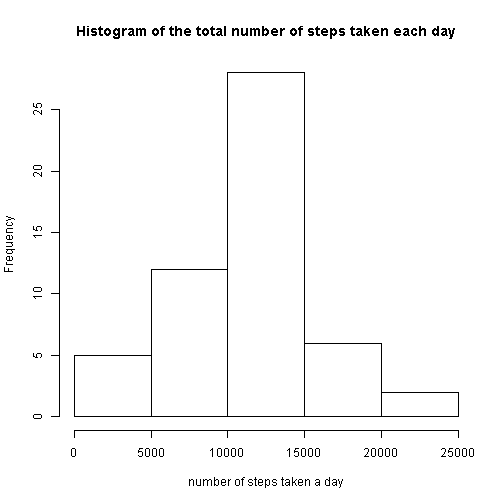

## Loading and preprocessing the data


```r
DT <- read.csv('activity.csv', 
               na.strings = 'NA', 
               stringsAsFactors = FALSE, 
               colClasses = c("integer", "Date", "integer"))
DT <- data.table(DT)
```

## What is mean total number of steps taken per day?


```r
#calculate total steps for every day in the dataset
steps_per_day <- DT[,list(total_steps=sum(steps)), by = date]

mean <- mean(steps_per_day[,total_steps], na.rm = TRUE)
median <- median(steps_per_day[,total_steps], na.rm = TRUE)
hist(steps_per_day[,total_steps], 
     main = "Histogram of the total number of steps taken each day",
     xlab = "number of steps taken a day")
```

 

mean of the total number of steps taken per day is **10766.19**

median of the total number of steps taken per day is **10765**

## What is the average daily activity pattern?


```r
#calculate total steps for every day in the dataset
steps_per_interval <- DT[complete.cases(DT),list(steps=mean(steps)), by = interval]
max_interval <- steps_per_interval[which.max(steps_per_interval[,steps]),interval]
#draw time-series plot of the 5-minute intervals and the average number of steps for each interval
with(steps_per_interval, 
     plot(interval, steps, 
          type = "l",
          main = "Time-series of the 5-minute intervals and the avg number of steps"))
```

 

Maximum number of steps, averaged across all the days in the dataset, was registered between **835** and **840**

## Imputing missing values

Strategy of filling missing values in the dataset is to use mean for 5-minutes interval.


```r
DT_imput <- DT
#list of indices with NA values in "steps" column
NA_ind <- which(is.na(DT_imput$steps))
# number of rows with missed(NA) values in "steps" column
NA_number <- length(NA_ind)
#calculate mean of steps for every interval
steps_imput <- DT_imput[,list(total_steps=mean(steps, na.rm = TRUE)), by = interval]

#fill missed (NA) values of "steps" column in DT_imput dataset with mean values (mean for interval)
for (i in NA_ind) {
  DT_imput$steps[i]  <- as.integer(steps_imput[steps_imput$interval == DT_imput$interval[i],total_steps])
}

#calculate total steps for every day in the dataset
steps_per_day <- DT_imput[,list(total_steps=sum(steps)), by = date]
mean_imput <- mean(steps_per_day[,total_steps], na.rm = TRUE)
median_imput <- median(steps_per_day[,total_steps], na.rm = TRUE)

#calculate mean, median for total steps per day after imputing data
mean_diff <- mean_imput - mean
mean_string <- paste(ifelse(mean_imput > mean, "increased by ", "decreased by "), 
                     format(abs(mean_diff), digits = 2, nsmall = 2))
median_diff <- median_imput - median
median_string <- paste(ifelse(median_imput > median, "increased by ", "decreased by "), 
                       abs(median_diff))

#Histogram of the total number of steps taken each day for imputed dataset
hist(steps_per_day[,total_steps],
     main = "Histogram of the total number of steps taken each day for imputed dataset",
     xlab = "number of steps taken a day")
```

 

Total number of rows with missing values in the dataset is **2304**

mean of the total number of steps taken per day after imputing is 
**10749.77 (decreased by  16.42)**

median of the total number of steps taken per day after imputing is 
**10641 (decreased by  124)**

## Are there differences in activity patterns between weekdays and weekends?


```r
#create factor variable indicating whether a given date is a weekday or weekend day
DT$weekfactor <- factor(ifelse(weekdays(as.Date(DT$date)) %in% c("Saturday", "Sunday"),
                               "weekend", 
                               "weekday"))
#calcucate average number of steps taken for 5-minute intervals, averaged across all weekday days or weekend days
steps_per_interval <- DT[complete.cases(DT),
                         list(steps=mean(steps)), 
                         by = c("interval", "weekfactor")]

xyplot(steps~interval|weekfactor, 
       data = steps_per_interval, 
       type = 'l', 
       main = "Time-series of the 5-minute intervals and the avg number of steps",
       layout = c(1, 2))
```

 
